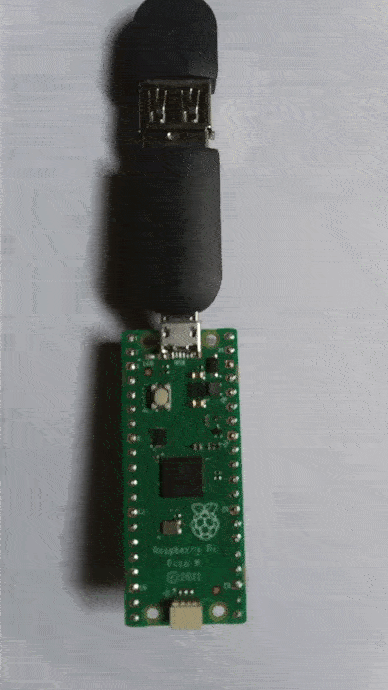

# pico_rust_setup
 

Options for Debug mode on a Pi Pico
```
1. Reconnecting USB while pressing ```BOOSTEL``` button every time you want to flash a program to the microcontroller
  https://www.youtube.com/watch?v=Yi0WRF5WPFw&ab_channel=LowLevelLearning
2. Connecting the Pico Degug pins to an external Rasberry Pi that has an OS installed. Then Flash the program with OpenOCD
  https://datasheets.raspberrypi.com/pico/getting-started-with-pico.pdf
3. Connecting the Pico Degug pins to an external Pi Pico. Then Flash the program with OpenOCD.
  https://www.digikey.com/en/maker/projects/raspberry-pi-pico-and-rp2040-cc-part-2-debugging-with-vs-code/470abc7efb07432b82c95f6f67f184c0
```

## Here we explore Option 1: Connecting micro-USB to Laptop while pressing ```BOOSTEL```


#### 0. Before trying any of the examples, please ensure you have the latest stable version of Rust installed, along with the right target support:
```bash
rustup self update # update your rust installation
rustup update stable # ensure you are on stable build
rustup target add thumbv6m-none-eabi # download the compilation target architecture
```

#### 1. Install Linux prerequisite Dependencies (assuming you run on ubuntu or alike) for ```elf2uf2-rs```
```bash
sudo apt install libudev-dev
sudo apt install pkg-config
```

#### 2. You may also want to install these helpful tools:
```bash
# Useful to creating UF2 images for the RP2040 USB Bootloader
cargo install elf2uf2-rs --locked
# Useful for flashing over the SWD pins using a supported JTAG probe
cargo install probe-run
```

#### 3. Download & Run Starter Code
```bash
git clone https://github.com/rp-rs/rp-hal
cd rp-hal
cargo run --release --example blinky
```

#### 4. Run another example

* a) Disconnect USB, 
* b) hold ```BOOSTEL```
* c) reconnect USB

```bash
cargo run --release --example pwm_blink
```




#### 5. Have Fun !!


## REFERENCES

 https://github.com/rp-rs/rp-hal
 https://datasheets.raspberrypi.com/pico/getting-started-with-pico.pdf
 https://www.youtube.com/watch?v=Yi0WRF5WPFw&ab_channel=LowLevelLearning
 https://www.digikey.com/en/maker/projects/raspberry-pi-pico-and-rp2040-cc-part-2-debugging-with-vs-code/470abc7efb07432b82c95f6f67f184c0
 